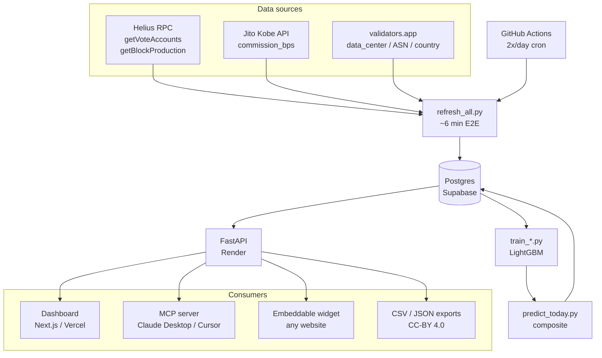

# stakesense

> Predictive validator quality oracle for Solana. ML-driven scoring on three pillars — downtime risk, MEV tax, decentralization — exposed as a REST API, dashboard, MCP server, embeddable widget, and Phantom-integrated stake flow.

[](https://stakesense.onrender.com/api/v1/health)
[](LICENSE)
[](docs/METHODOLOGY.md)
[](https://colosseum.com/frontier)
[](#testing)
[](docs/SUBMISSION.md)

## Live

| | URL |
|---|---|
| Dashboard | https://stakesense-el77-git-main-california-mortgage-solutions.vercel.app |
| Validators | [/validators](https://stakesense-el77-git-main-california-mortgage-solutions.vercel.app/validators) |
| Compare | [/compare](https://stakesense-el77-git-main-california-mortgage-solutions.vercel.app/compare) |
| Portfolio analyzer | [/portfolio](https://stakesense-el77-git-main-california-mortgage-solutions.vercel.app/portfolio) |
| Stake (devnet) | [/stake](https://stakesense-el77-git-main-california-mortgage-solutions.vercel.app/stake) |
| Backtest | [/backtest](https://stakesense-el77-git-main-california-mortgage-solutions.vercel.app/backtest) |
| Methodology | [/methodology](https://stakesense-el77-git-main-california-mortgage-solutions.vercel.app/methodology) |
| About | [/about](https://stakesense-el77-git-main-california-mortgage-solutions.vercel.app/about) |
| Open data | [/data](https://stakesense-el77-git-main-california-mortgage-solutions.vercel.app/data) |
| MCP integration | [/integrations/mcp](https://stakesense-el77-git-main-california-mortgage-solutions.vercel.app/integrations/mcp) |
| REST API | https://stakesense.onrender.com/docs |
| Model Card | [MODEL_CARD.md](MODEL_CARD.md) |
| Methodology paper | [docs/METHODOLOGY.md](docs/METHODOLOGY.md) |
| Submission packet | [docs/SUBMISSION.md](docs/SUBMISSION.md) |

## What it does

For every active Solana mainnet validator, stakesense computes:

1. **Downtime risk** — LightGBM classifier predicting probability of skip-rate spike or delinquency in the next 3 epochs.
2. **MEV tax** — fraction of MEV revenue the validator keeps for themselves vs. passes to delegators.
3. **Decentralization** — penalty for sharing data center / ASN / country with many others; bonus for staying out of superminority.

Plus a transparent composite: `0.5·(1−downtime) + 0.3·(1−mev_tax) + 0.2·decentralization`.

Every weight, every feature, every model is open source. The full long-form methodology lives in [`docs/METHODOLOGY.md`](docs/METHODOLOGY.md).

## Architecture



## Numbers (live)

- **789** active validators scored
- **752** with full geographic metadata
- **5,500+** epoch-performance rows
- **2,186** MEV-commission observations
- **3,914** composite predictions written
- **2.7%** delinquent share captured
- **18/18** tests passing
- Cron: **2x/day**, mean ~6 min E2E, green for 7+ days

Refresh `https://stakesense.onrender.com/api/v1/stats` for the current numbers.

## Sponsor stack

| Sponsor | Surface | Status |
|---|---|---|
| **Phantom** | Wallet-adapter staking flow on `/stake` | ✅ Wired (devnet) |
| **Privy** | Email / social embedded wallet on `/stake` | ✅ Wired (gracefully no-op without `NEXT_PUBLIC_PRIVY_APP_ID`) |
| **Squads** | DAO multisig staking flow on `/stake/dao` | 🚧 Day 5 |
| **Solana Foundation** | Nakamoto coefficient surfacing, decentralization-first scoring, Public Goods track | ✅ Surfaced in `/stats` and landing |

## Public-goods commitments

- **MIT-licensed code**, **CC-BY 4.0 data exports** under `/data`
- Reproducible methodology with model card and walk-forward backtest
- Free public REST API (rate-limited; no key needed for read endpoints)
- MCP server for AI agents — `npm i -g stakesense-mcp` then `claude mcp add stakesense -- npx stakesense-mcp`
- Daily CSV/JSON exports — `https://stakesense.onrender.com/api/v1/export/predictions.csv`
- Open issues + welcoming PRs

## FAQ

**Is the score predictive or descriptive?**
Predictive on downtime (3-epoch lookahead) and MEV (3-epoch lookahead). Descriptive on decentralization (it's a network-state metric, not a forecast).

**Can I trust the AUC right now?**
Early in the project's life, history is thin and the trained classifier may underperform. We fall back to a deterministic predictor whose rank order is stable. As the cron accumulates more epochs, the trained model takes over. Run `pytest` to see current state, or check `/api/v1/health` for the active model.

**Why composite weights of 0.5/0.3/0.2?**
Heuristic, not learned. They reflect a delegator-centric economic view (downtime cost > MEV leakage > decentralization preference). The validators page accepts custom weights via query string: `/validators?w_downtime=0.7&w_mev=0.2&w_dec=0.1`.

**Is this investment advice?**
No. Predictions are a public good; please form your own staking strategy.

**Can I run my own copy?**
Yes — see "Run locally" below. The whole pipeline boots in ~15 minutes from a fresh clone.

**What about mainnet staking?**
Currently `/stake` connects to **devnet**. Mainnet is a post-hackathon priority. You can use any wallet to stake mainnet to a validator we recommend by copying the vote pubkey into your existing staker.

**Where do the data center / ASN / country fields come from?**
[validators.app](https://www.validators.app). Validators that haven't registered there will have empty fields and a default decentralization score; we re-pull metadata every cron run.

**Is the dataset license CC-BY?**
Yes. Code is MIT. The published predictions and decentralization snapshots are CC-BY 4.0 — you're free to reuse them in commercial or open-source projects with attribution.

## Repo layout

```
api/
  src/stakesense/
    api/         # FastAPI service
    db/          # SQLAlchemy models + repos
    sources/     # Solana RPC, Jito, Stakewiz, validators.app
    features/    # rolling-window + static feature engineering
    training/    # LightGBM downtime classifier + MEV regressor
    scoring/     # rule-based decentralization + composite + backtest
  scripts/       # refresh_all, train_*, predict_today, data_quality
  tests/         # pytest suite (18 tests, run on every commit)
web/
  app/           # Next.js 16 App Router pages
  components/    # WalletProvider, ConnectBar, HistoryCharts, etc.
  lib/           # API client + types
mcp/
  src/           # stakesense-mcp server (Day 2)
docs/
  ROADMAP.md             # 7-day victory plan
  SUBMISSION.md          # judge-friendly project overview
  DEMO_SCRIPT.md         # 2-min demo video script + shot list
  METHODOLOGY.md         # long-form methodology paper
  superpowers/specs/     # design spec
  superpowers/plans/     # implementation plan
.github/workflows/
  refresh-data.yml       # 2x/day cron
MODEL_CARD.md   # model documentation + limitations
LICENSE         # MIT
```

## Run locally

```bash
git clone https://github.com/mikejohnkurkeyerian-eng/stakesense
cd stakesense

# API
cd api
python -m venv .venv && source .venv/Scripts/activate
pip install -e ".[dev]"
cp ../.env.example ../.env  # fill in Helius, Supabase, validators.app keys
python scripts/migrate.py
python scripts/refresh_all.py        # ~6 min
python scripts/predict_today.py
uvicorn stakesense.api.main:app --reload --port 8000

# Web (in another terminal)
cd ../web
pnpm install
echo "NEXT_PUBLIC_API_BASE=http://localhost:8000" > .env.local
pnpm dev
```

Open http://localhost:3000.

## Testing

```bash
cd api
pytest                 # 18 tests, all integration-grade against live DB
```

Tests use a sentinel pubkey (`TEST_FIXTURE_Vote111_DO_NOT_USE_AS_REAL`) so they're safe to run against the production database — they never trample real validator rows.

## Hackathon

Built solo for [Solana Frontier (Colosseum)](https://colosseum.com/frontier), 2026-04-06 → 2026-05-11. Targeting Public Goods $10k tier (open-source) + Standout 20 ($10k) + sponsor bounties.

Submission packet: [`docs/SUBMISSION.md`](docs/SUBMISSION.md).
Demo script: [`docs/DEMO_SCRIPT.md`](docs/DEMO_SCRIPT.md).
Roadmap: [`docs/ROADMAP.md`](docs/ROADMAP.md).

## License

MIT for code · CC-BY 4.0 for data exports — see [LICENSE](LICENSE) and `docs/METHODOLOGY.md` §6.
